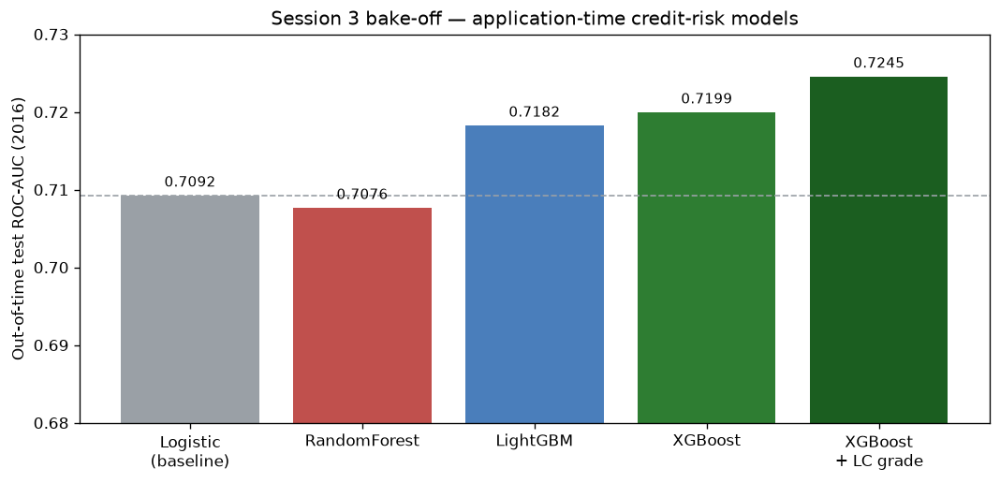
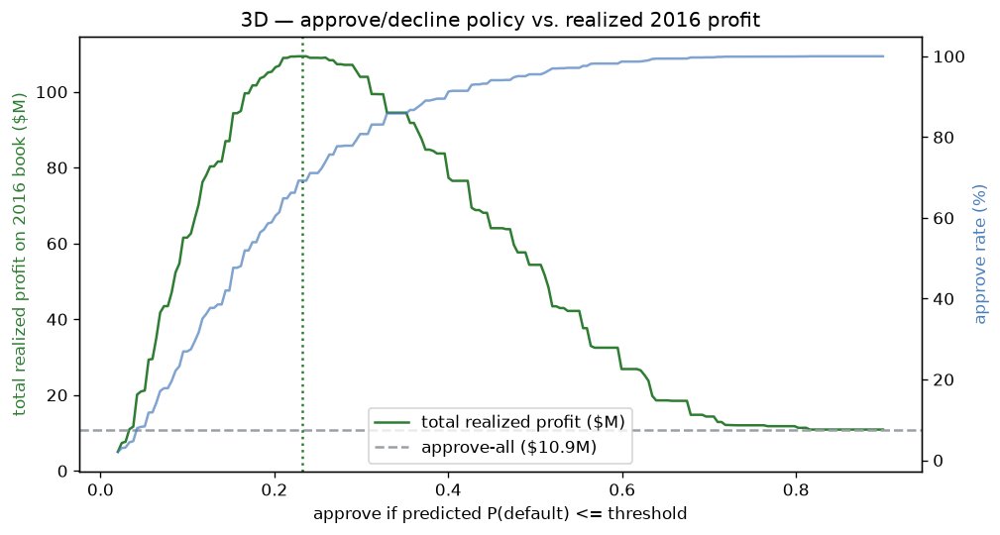
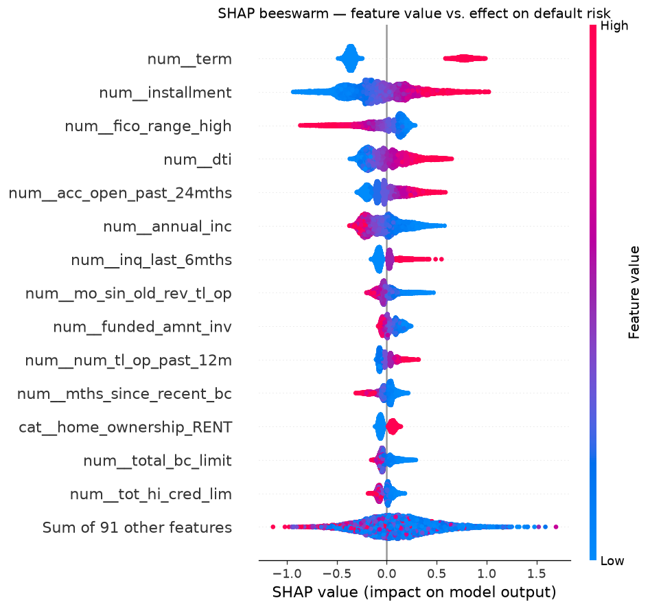

# Lending Club — Credit-Risk Default Model

Predict, using **only information known at loan application**, whether a
Lending Club loan will default (charge off) rather than be repaid — then turn
that model into an approve/decline decision with an **expected-loss / P&L**
justification.

This is a credit-risk portfolio project: model → decision → dollars. The
central discipline is **avoiding data leakage** (never train on anything that
is only known after a loan is originated).

## Results at a glance

- **Model:** calibrated **XGBoost** on application-time features only —
  **out-of-time (2016) ROC-AUC 0.72 · Gini 0.44 · KS 0.32.**
- **Leakage-safe & interpretable:** SHAP confirms economically sensible drivers,
  with **no post-origination leakage and no geographic proxy** — a model-risk
  sanity check it passes.
- **Business impact, honestly stated:** a PD-based approve/decline policy raises
  realized profit; a stricter-cutoff **sensitivity check** puts the defensible
  figure at **≈ +\$35M for a ~10% decline** (the raw 2016 number was inflated by
  censoring — and we show exactly how much).
- **LendingClub's own grade adds only +0.005 AUC** — the model recovers LC's
  risk assessment from raw application data.



### What this project demonstrates

- **Leakage discipline** end-to-end — a documented keep/drop/leakage column
  triage, verified all the way through with SHAP.
- **Honest out-of-time evaluation** that *surfaces* concept drift and
  survivorship bias rather than hiding them, with **sensitivity checks** that
  quantify their impact.
- **Business framing:** model → decision → dollars, via a realized-cashflow P&L
  with its limitations stated plainly.
- **Regulatory awareness:** geography excluded for fair lending; SHAP-based
  adverse-action interpretability (SR 11-7-style model risk). See the
  [fair-lending methodology](reports/fair_lending.md).
- **Engineering:** reproducible scripts, out-of-time CV tuning, a serving
  bundle, and an interactive Streamlit scorer.

**Read order:** `notebooks/02` (baseline) → `03` (bake-off, calibration, P&L,
sensitivity checks) → `04` (SHAP) · `reports/recommendation.md` (business memo) ·
`streamlit run app.py` (interactive scorer).

## Status

- [x] **Session 1 — setup & data triage**
  - [x] Project scaffold, environment, download + load pipeline
  - [x] Download dataset (Kaggle OAuth) → SQLite (2,260,701 rows × 151 cols)
  - [x] Keep / drop / leakage column triage (`reports/data_dictionary.csv`)
- [x] **Session 2 — label, out-of-time split, logistic baseline**
  - Baseline (out-of-time test): **ROC-AUC 0.709 · Gini 0.419 · KS 0.301**
- [x] **Session 3 — model bake-off, calibration & P&L**
  - Winner **XGBoost** (out-of-time test): **ROC-AUC 0.720 · Gini 0.440 · KS 0.316**
  - LC's own grade adds only **+0.005 AUC**; risk-based cutoff materially lifts realized 2016 profit
- [x] **Session 4 — SHAP interpretability**
  - Drivers economically sensible, no leakage/proxy in the ranking (model-risk sanity check passed)
- [x] **Session 5 — Streamlit app + written recommendation**
  - Interactive scorer (`app.py`) + business memo (`reports/recommendation.md`)

### Session 2 — decisions & results

**Label.** `Charged Off` / `Default` → 1, `Fully Paid` → 0; all in-progress
loans dropped so every row has a conclusive outcome. 1,345,350 finished loans,
base default rate 19.97%.

**Maturity cutoff.** Loans issued after **Dec 2016** are dropped. Recent
vintages are heavily right-censored — 2017 loans are ~59% still `Current`, so
their finished loans are a biased fast-resolving subsample. 2016 is ~31%
censored but kept for its volume, with the bias documented. *A stricter cutoff
(through 2015) remains a candidate sensitivity check.*

**Out-of-time split.** Train on loans issued **≤ 2015-12** (826,606 rows),
test on **all of 2016** (293,105 rows). Chosen over a random split because
production always predicts the future from the past; a random split hides
temporal drift rather than avoiding it. The design already paid off — it
exposed a train→test default-rate jump (18.4% → 23.3%) and 12 secondary-applicant
features that postdate the training era and are therefore unusable here.

**Preprocessing** (fit on train only, via a scikit-learn `Pipeline`): median
impute + missing-indicator + standardize for numerics; constant impute +
one-hot (drop-first) for categoricals.

**Model.** L2 (ridge) logistic regression, untuned — the floor for later
models. No class reweighting, to keep probabilities calibrated for the
expected-loss decision in a later session. `grade`/`sub_grade`/`int_rate` are
held out of training for a with/without-LC comparison (KFCDT).

Code: `src/data_prep.py` (label, split, preprocessing), `src/train_baseline.py`
(runnable), `notebooks/02_baseline_logistic.ipynb` (narrative + ROC/KS plots).

### Session 3 — bake-off, calibration & P&L

**Bake-off (3A).** RandomForest, XGBoost, LightGBM, each tuned with
`RandomizedSearchCV` over a `TimeSeriesSplit(3)` (folds respect time); model
selection by cross-validated AUC, reported out-of-time on 2016.

| Model | Test AUC | Gini | KS |
|-------|---------:|-----:|---:|
| **XGBoost (winner)** | **0.720** | 0.440 | 0.316 |
| LightGBM | 0.718 | 0.436 | 0.314 |
| RandomForest | 0.708 | 0.415 | 0.298 |
| Logistic (Session 2) | 0.709 | 0.419 | 0.301 |

Boosting beats the logistic baseline only modestly (+0.011 AUC) — credit-default
signal is largely monotonic. RandomForest *lost* to the logistic baseline
despite far more compute: complexity ≠ accuracy.

**LC-grade comparison (3C).** Refitting the winner with `grade`/`sub_grade`/
`int_rate` adds only **+0.005 AUC** — the application-time features already
recover almost all of LC's own risk grade.

**Calibration (3B).** Time-based fold (fit ≤2014, calibrate on 2015, test 2016).
Isotonic calibration improves Brier 0.1634 → 0.1609, but the model still
**under-predicts 2016 risk** — concept drift the out-of-time design makes visible.

**P&L backtest (3D).** Realized cashflow per loan =
`total_pymnt + recoveries − funded_amnt` (leakage as features; used only to
score the policy's realized outcome). Empirical LGD on 2016 defaults ≈ 63%.
The profit-maximizing cutoff (**PD ≤ ~0.23**) declines the riskiest ~31%, cuts
the book default rate 23% → 16%, and lifts realized profit from ~\$11M to
~\$109M. *Caveats:* the absolute uplift is inflated by 2016 censoring (the
shape is robust, the dollar figure optimistic); undiscounted; a 31% decline is
commercially aggressive.



**Sensitivity checks.** (1) Re-running on a stricter Dec-2015 cutoff (~10%
censored) confirms the censoring caveat: model conclusions hold (XGBoost wins,
LC-grade negligible), but the honest P&L uplift is **≈ +\$35M at a ~10% decline
rate**, not +\$98M at 31%. (2) L1/elastic-net logistic match the L2 baseline AUC
exactly and prune almost nothing — no cheap redundancy, consistent with the
broad SHAP importance. Code: `src/sensitivity_cutoff.py`, `src/sensitivity_penalty.py`.

Code: `src/bakeoff.py` (3A+3C), `src/calibrate_and_pnl.py` (3B+3D),
`notebooks/03_model_bakeoff.ipynb` (narrative + figures). Tuned model binaries
are saved to `models/` (gitignored; regenerate via the scripts).

### Session 4 — SHAP interpretability

TreeSHAP on the app-only XGBoost winner (10k-loan sample of the 2016 test set).
The point is a model-risk sanity check, not another metric.

**Top drivers** (mean |SHAP|), all economically sensible and application-time:
`term` (60-month → higher risk) ≫ `installment`, `fico_range_high`, `dti`,
`acc_open_past_24mths`, `annual_inc`, `inq_last_6mths`, credit-history length,
`home_ownership_RENT`. The beeswarm confirms every **direction** matches credit
intuition (higher FICO/income/history → lower risk; higher DTI/inquiries/recent
credit-seeking → higher risk).



**Why it matters:** (1) no post-origination feature appears anywhere — the
column triage held; (2) no geography proxy (ZIP/state were dropped) and no
single feature dominates implausibly — the model earns its AUC broadly, not via
a shortcut; (3) individual scores decompose into intelligible contributions.
This is what a model-validation review (SR 11-7) looks for.

Code: `src/shap_analysis.py`, `notebooks/04_shap_interpretability.ipynb`;
figures + `reports/shap_importance.csv` under `reports/`.

### Session 5 — Streamlit app & recommendation

`app.py` serves the **calibrated XGBoost** as an interactive scorer: enter a loan
application → calibrated **P(default)** → **approve/decline** at an adjustable
cutoff (default ≈ the profit-max 0.23), with **expected loss** (PD × LGD ×
amount) and a **per-loan SHAP waterfall** explaining the score. A handful of
top-SHAP features are exposed as inputs; the rest use training defaults from the
serving bundle.

```bash
python src/build_serving_model.py     # -> models/serving_bundle.joblib (once)
streamlit run app.py                  # http://localhost:8501
```

`reports/recommendation.md` is the business memo tying it together: model →
decision → dollars, with the model-risk limitations spelled out.

**Project complete** — model → decision → dollars, leakage-safe end to end.

## Dataset

Kaggle **`wordsforthewise/lending-club`** — the most complete current mirror.
We model `accepted_2007_to_2018Q4.csv.gz` (~2.2M funded loans, 151 columns).
Rejected applications are out of scope for now.

## Setup

```bash
# 1. Create the environment (Python 3.14, venv already scaffolded)
python3 -m venv venv
./venv/bin/pip install -r requirements.txt

# 2. Give Kaggle an API token (one-time). Either:
./venv/bin/kaggle auth login                 # OAuth, browser prompt
# ...or create a token at https://www.kaggle.com/settings -> API -> Create New Token
#    then: mkdir -p ~/.kaggle && mv ~/Downloads/kaggle.json ~/.kaggle/ && chmod 600 ~/.kaggle/kaggle.json

# 3. Download + load (or just run the notebook, which does both)
./venv/bin/python src/download_data.py        # -> data/raw/accepted_2007_to_2018Q4.csv.gz
./venv/bin/python src/load_to_sqlite.py       # -> data/lending_club.db (table `loans`)

# 4. Explore
./venv/bin/jupyter lab notebooks/01_load_and_triage.ipynb
```

The venv is registered as a Jupyter kernel named **"Python (Lending Club)"** —
select it in the notebook. `requirements-lock.txt` pins exact versions.

> **macOS note:** `xgboost`/`lightgbm` need the OpenMP runtime. If they fail to
> import with a `libomp.dylib` error, run `brew install libomp`.

## Layout

```
├── data/
│   ├── raw/                  # downloaded CSV(s) — gitignored
│   └── lending_club.db       # SQLite, table `loans` — gitignored
├── notebooks/
│   └── 01_load_and_triage.ipynb
├── src/
│   ├── download_data.py      # Kaggle download
│   ├── load_to_sqlite.py     # chunked CSV -> SQLite
│   └── lc_data_dictionary.py # column descriptions + leakage flags
├── reports/
│   └── data_dictionary.*     # generated: annotated triage worksheet
├── requirements.txt / requirements-lock.txt
```

## The leakage rule

For every column ask: **would a lender know this the day the application
arrives?** If not, exclude it. Flags used in the data dictionary:

| Flag | Meaning | Action |
|------|---------|--------|
| `TARGET` | The outcome (`loan_status`) | Build the label from it, don't use as feature |
| `SAFE` | Known at application time | Use as a predictor |
| `LC_MODEL` | Known at application, but is LC's own risk output (`grade`, `sub_grade`, `int_rate`) | Use deliberately — see note |
| `LEAKAGE` | Only known after origination (`recoveries`, `total_pymnt`, `out_prncp`, ...) | **Exclude** |
| `REVIEW` | Judgment call | Decide during triage |

**On `grade`/`int_rate`:** these are legitimate (set before funding) but they
*are* LC's own risk model. Plan: train one model with them and one without, to
measure how much of your signal is just re-learning LC's grade.

## Column triage

_Generated worksheet: `reports/data_dictionary.csv`. Record final decisions and
reasoning here once the data is loaded._

| Decision | Columns | Reasoning |
|----------|---------|-----------|
| **Drop (leakage)** | _tbd_ | Post-origination |
| **Keep (features)** | _tbd_ | Known at application |
| **Use deliberately** | `grade`, `sub_grade`, `int_rate` | LC's own risk output |
| **Target** | `loan_status` | Charged Off/Default = 1, Fully Paid = 0 |
